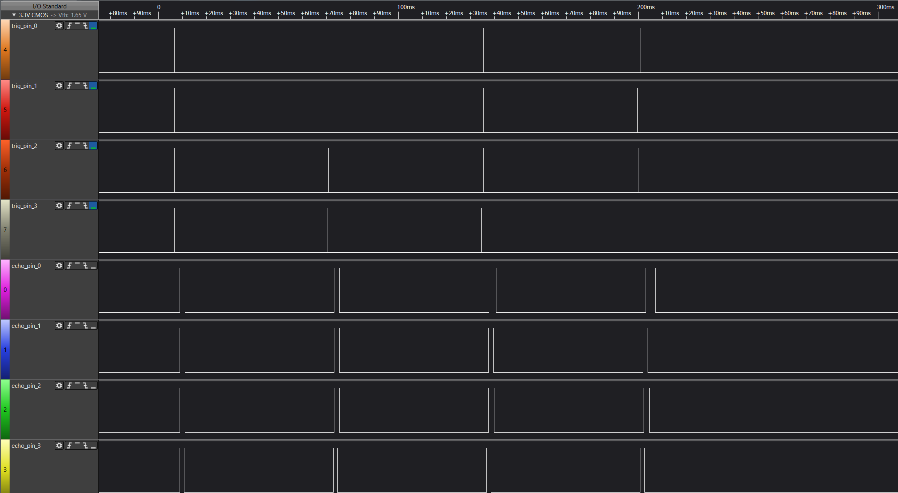
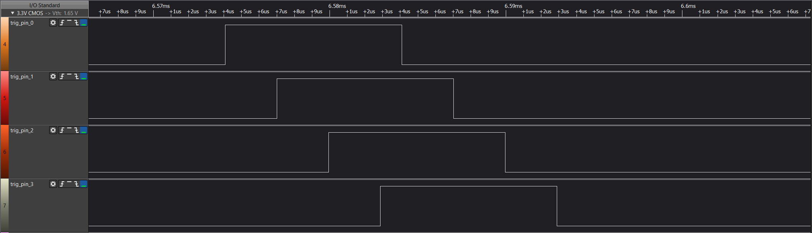
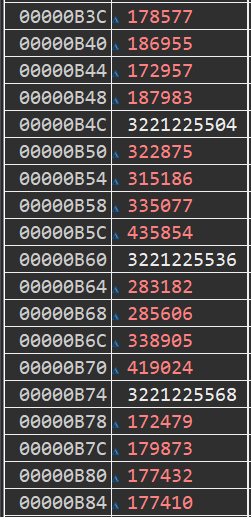

# Ultrasonic Sensors FPGA Core
> 
> A portable core which controls up to 4 HC-SR04 ultrasonic distance sensors without blocking program execution while generating or capturing pulse widths.
> 
> The core interfaces with a 32-bit softcore processor through a bridge which translates the processor's read/write transactions to operations on the core.
> 
> Only a 5-bit word addressable space is required for the core.
## Description 
> 
> ### Hardware
> 
> The range_sensor_subsystem.sv core provides 3 functional capabilities:
> > 
> > - Generate Pulse - generate successive pulses (up to 16) on the trigger pin of a selected HC-SR04 sensor.
> > 
> > - Capture Distance - capture pulse widths (up to 32) on the echo pins of all HC-SR04 sensors.
> > 
> > - Produce Distance - produce to the processor captured pulse widths.
> >
>### Design Hierarchy
>
```
range_sensor_subsystem.sv 
`-- range_sensor_core.sv (x4)
    |-- range_sensor_ctrl.sv 
    |   |-- fifo_fwft.sv
    |   |   |-- fifo_fwft_ctrl.sv
    |   |   `-- ram.sv
    |   `-- range_sensor_fsmd.sv
    `-- range_sensor_subsystem_ctrl.sv  
```
>
>### Diagrams
>
> The range_sensor_subsystem.sv core is a composition of 4 range_sensor_core.sv modules. The block diagram for each range_sensor_core.sv module is shown below
> 
> 
> 
> The state diagram for the range_sensor_fsmd.sv module is shown below
> 
> 
> 
> ### Software
> Each HC-SR04 sensor is allocated an addressable slot on the range_sensor_subsystem.sv core. The register map for each range_sensor_core.sv module is shown below
> 
> 
> 
> Software interacts with the hardware through a RangeSensorCore class with the following methods:
> 
> ```cpp
> /**
> * Generates 10us pulses on trigger pin
> * @note the method does not block the program execution
> */
> void gen_pulse();
> /**
> * Update data structure with prior pulse widths on echo pin (in clock cycles)
> */
> void rd_dist_ticks();
> /**
> * Check FIFO's full status
> */
> bool is_fifo_full();
> /**
> * Check FIFO's empty status
> */
> bool is_fifo_empty();
> ```
>
## Demo
> 
> Sampled data from the trigger and echo pins of each HC-SR04 sensor.
> 
> 
> 
> The demo instantiates 4 RangeSensorCore objects and each object calls gen_pulse() once. A pulse count of 4 is defined in range_sensor_core.h
> 
> ```cpp 
> RangeSensorCore sen0(get_slot_addr(BRIDGE_BASE, S0_RANGE_SENSOR));
> RangeSensorCore sen1(get_slot_addr(BRIDGE_BASE, S1_RANGE_SENSOR));
> RangeSensorCore sen2(get_slot_addr(BRIDGE_BASE, S2_RANGE_SENSOR));
> RangeSensorCore sen3(get_slot_addr(BRIDGE_BASE, S3_RANGE_SENSOR));
> 
> sen0.gen_pulse();
> sen1.gen_pulse();
> sen2.gen_pulse();
> sen3.gen_pulse();
> ```
> 
> 
> 
> The hardware captures the pulse widths on the echo pins of each HC-SR04 sensor simultaneously.
> 
> 
> 
> The demo calls rd_dist_ticks() for each RangeSensorCore object which updates their _dist_arr member with the pulse widths.
> 
> ```cpp
> sen0.rd_dist_ticks();
> sen1.rd_dist_ticks();
> sen2.rd_dist_ticks();
> sen3.rd_dist_ticks();
> ```
>
> Below displays a memory snapshot of each RangeSensorCore object's _dist_arr member.
>
> 

